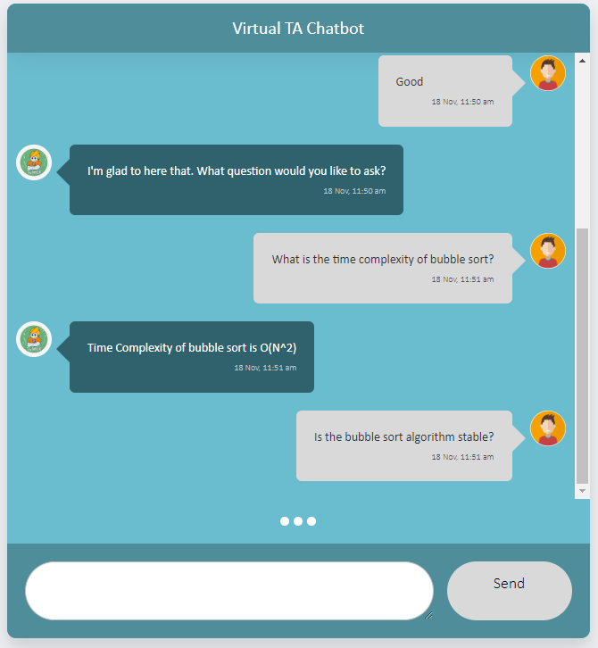

# Chatbot Frontend
A simple chatbot frontend for plugging in my bots.

To add a user message to the chat window
run javascript function -

    showUserMessage("Message",getCurrentTimestamp());

To add a bot message to the chat window
run javascript function -

    showBotMessage("Message",getCurrentTimestamp());

## Screenshot

## Instructions to run locally

Download clone files on right under releases tab and put files into folder called ClassInfoTAPipeline and put folder in backend folder

Go to backend directory in terminal

Install python 3
https://www.python.org/downloads/

Install flask:
pip install flask

Install flask-cors
pip install -U flask-cors

Install PyTorch:
https://pytorch.org/get-started/locally/
Go to this website and select the correct options based on your machine. Copy the command given and run
Sample command: pip3 install torch torchvision torchaudio

Install transformers:
pip install transformers
